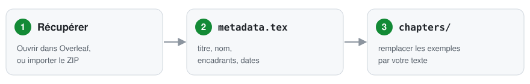
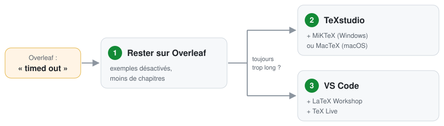

# Modèle non officiel de mémoire LMFI

Un modèle LaTeX, en français ou en anglais, pour le mémoire du M2 LMFI
(*Logique Mathématique et Fondements de l'Informatique*) de l'Université Paris Cité.
Ce n'est pas un modèle officiel : les consignes de votre encadrement priment.

· [English version](README.md)

## Utilisation

1. **Récupérez le modèle.** Cliquez sur **Ouvrir dans Overleaf** ci-dessus et
   connectez-vous : Overleaf crée votre propre copie et la compile. Ou
   téléchargez le ZIP puis, dans Overleaf, cliquez sur **Nouveau projet** et
   importez le ZIP (sans le décompresser). Dans ce cas, dans la liste des
   fichiers, cliquez sur **⋮** à côté de `main-fr.tex` et choisissez de le
   définir comme document principal.
2. **Remplissez vos informations.** Dans la liste des fichiers à gauche, ouvrez
   `metadata.tex`. Remplacez le texte d'exemple entre les accolades `{ }` par
   votre titre, votre nom, vos encadrants, les dates et les mots-clés, puis
   cliquez sur **Recompiler**.
3. **Rédigez votre mémoire.** Ouvrez un à un les fichiers de `chapters/fr/` et
   remplacez le texte d'exemple par le vôtre. Les lignes qui commencent par `%`
   sont des conseils : elles n'apparaissent jamais dans le PDF et vous pouvez
   les supprimer.

Téléchargez le PDF avec le bouton de téléchargement au-dessus de l'aperçu.

## Modifications courantes

- **Retirer ou ajouter une partie** (remerciements, résumé en anglais, listes
  des figures et des tableaux, annexes) : à la fin de `metadata.tex`, chaque
  partie a une ligne qui se termine par `true` (affichée) ou `false` (retirée).
  Changez ce mot, par exemple `\includeacknowledgementstrue` devient
  `\includeacknowledgementsfalse`, puis cliquez sur **Recompiler**.
- **Voir des exemples LaTeX** (figures côte à côte, tableaux longs, code, unités,
  abréviations, page en paysage) : dans `metadata.tex`, remplacez
  `\includeexamplesfalse` par `\includeexamplestrue` et cliquez sur
  **Recompiler**. Ils apparaissent en annexes B et C ; copiez ce qui vous sert,
  puis remettez `false`.
- **Ajouter un logo :** importez l'image dans votre projet Overleaf (par exemple
  `logo.png`), puis indiquez son nom dans la première ligne de logo de
  `metadata.tex` : `\newcommand{\ThesisLogoFile}{logo.png}`. Le logo de
  l'université se trouve sur sa [page de charte graphique](https://u-paris.fr/charte-graphique-et-outils/). Les deux
  autres lignes servent à d'autres logos ; écrivez `none` dans une ligne pour
  retirer son cadre.
- **Ajouter un chapitre :** copiez un fichier de `chapters/fr/` sous un nouveau
  nom, puis ajoutez une ligne comme `\include{chapters/fr/06-nouveau-chapitre}`
  dans `main-fr.tex`, sous les autres lignes `\include`.
- **Ajouter une référence :** collez son entrée BibTeX (par exemple depuis Google
  Scholar, *Citer → BibTeX*) dans `references.bib`, et citez-la avec
  `\cite{clé}`.
- **Renvois :** `\cref` n'écrit pas l'article ; écrivez « la \cref{fig:...} »,
  « le \cref{tab:...} », « de l'\cref{eq:...} ».

## Si Overleaf affiche « timed out »

Un compte Overleaf gratuit arrête une compilation au bout de 10 secondes.

1. **Rester sur Overleaf.** Laissez les exemples désactivés
   (`\includeexamplesfalse`). Dans `main-fr.tex`, supprimez le `%` au début de
   la ligne `\includeonly{...}` et n'y indiquez que les chapitres en cours.
2. **Compiler sur votre ordinateur (le plus simple).** Installez
   [MiKTeX](https://miktex.org/download) sous Windows ou [MacTeX](https://tug.org/mactex/) sous macOS, puis
   [TeXstudio](https://www.texstudio.org/). Dans Overleaf, téléchargez la source
   du projet (menu **Fichier → Télécharger**, format .zip) et décompressez-la. Ouvrez `main-fr.tex` dans TeXstudio et
   appuyez sur **F5**.
3. **Si vous utilisez déjà VS Code.** Installez [TeX Live](https://tug.org/texlive/acquire-netinstall.html) ([MacTeX](https://tug.org/mactex/)
   sous macOS ; plusieurs Go), puis l'extension [LaTeX Workshop](https://marketplace.visualstudio.com/items?itemName=James-Yu.latex-workshop). Ouvrez le
   dossier décompressé, puis `main-fr.tex`, et appuyez sur **Ctrl+Alt+B**.

## Fichiers

| Fichier | Contenu |
|---|---|
| `main-fr.tex`, `main.tex` | Les fichiers à compiler (français, anglais). On y ajoute les nouveaux chapitres. |
| `metadata.tex` | Vos informations et les options. Commencez ici. |
| `chapters/fr/`, `chapters/en/` | Un fichier par chapitre. |
| `frontmatter/` | Page de titre, résumés, remerciements. |
| `references.bib` | Votre bibliographie. |
| `appendices/` | A : une courte annexe. B et C : exemples LaTeX, affichés seulement si vous les activez (voir ci-dessus). |
| `macros.tex` | Votre notation et vos abréviations. |
| `preamble.tex` | Paquets et mise en page ; en général, n'y touchez pas. |
| `LICENSE` | La licence du modèle (LPPL 1.3c). Inutile pour compiler. |

## Pour en savoir plus

- Pourquoi A4, pdfLaTeX, citations numériques, etc. :
  [docs/LMFI_RECOMMENDATIONS.md](docs/LMFI_RECOMMENDATIONS.md).
- Licence : LaTeX Project Public License 1.3c. Maintenu par Kaiyuan GONG. Votre
  mémoire reste le vôtre.
