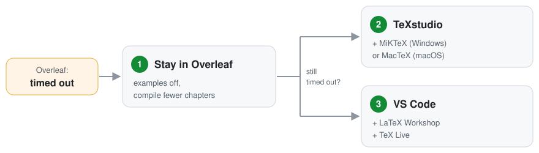

# Unofficial LMFI Master's Thesis Template

A LaTeX template, in English or French, for the master's thesis of the M2 LMFI
(*Logique Mathématique et Fondements de l'Informatique*) at Université Paris Cité.
It is not an official template: your supervisor's instructions come first.

· [Version française](README-fr.md)

## How to use

1. **Get the template.** Click **Open in Overleaf** above and log in: Overleaf
   makes your own copy and compiles it. Or download the ZIP, then in Overleaf
   click **New project** and upload the ZIP (do not unzip it).
2. **Fill in your details.** In the file list on the left, open `metadata.tex`.
   Replace the example text inside the braces `{ }` with your title, name,
   supervisors, dates and keywords, then click **Recompile**.
3. **Write your thesis.** Open the files in `chapters/en/` one by one and replace
   the example text with yours. Lines starting with `%` are advice for you: they
   never appear in the PDF, and you can delete them.

Download the PDF with the download button above the preview.

## Common changes

- **Leave out or add a part** (acknowledgements, the French abstract, lists of
  figures and tables, the appendices): at the end of `metadata.tex`, each part
  has a line ending in `true` (shown) or `false` (left out). Change the word,
  for example `\includeacknowledgementstrue` becomes
  `\includeacknowledgementsfalse`, and click **Recompile**.
- **See LaTeX examples** (figures side by side, long tables, code, units,
  abbreviations, a landscape page): change `\includeexamplesfalse` to
  `\includeexamplestrue` in `metadata.tex` and click **Recompile**. They appear as
  Appendices B and C; copy what you need, then change the line back to `false`.
- **Add a logo:** upload the image to your Overleaf project (for example
  `logo.png`), then put its name in the first logo line of `metadata.tex`:
  `\newcommand{\ThesisLogoFile}{logo.png}`. The university logo is on its
  [brand page](https://u-paris.fr/charte-graphique-et-outils/). The two other lines are for more logos; write `none`
  in a line to remove its box.
- **Add a chapter:** copy a file in `chapters/en/` under a new name, then add a
  line such as `\include{chapters/en/06-new-chapter}` in `main.tex`, below the
  other `\include` lines.
- **Add a reference:** paste its BibTeX entry (for example from Google Scholar,
  *Cite → BibTeX*) into `references.bib`, and cite it with `\cite{key}`.

## If Overleaf says "timed out"

A free Overleaf account stops a compile after 10 seconds.

1. **Stay in Overleaf.** Keep the examples off (`\includeexamplesfalse`). In
   `main.tex`, delete the `%` at the start of the `\includeonly{...}` line and
   list there only the chapters you are writing.
2. **Compile on your computer (easiest).** Install [MiKTeX](https://miktex.org/download) on Windows or
   [MacTeX](https://tug.org/mactex/) on macOS, then [TeXstudio](https://www.texstudio.org/). In Overleaf, click
   **File → Download → Download as source (.zip)** and unzip it. Open `main.tex` in TeXstudio and
   press **F5**.
3. **If you already use VS Code.** Install [TeX Live](https://tug.org/texlive/acquire-netinstall.html) ([MacTeX](https://tug.org/mactex/) on
   macOS; several GB), then the [LaTeX Workshop](https://marketplace.visualstudio.com/items?itemName=James-Yu.latex-workshop) extension. Open the
   unzipped folder, open `main.tex`, and press **Ctrl+Alt+B**.

## Files

| File | Content |
|---|---|
| `main.tex`, `main-fr.tex` | The files to compile (English, French). Add new chapters here. |
| `metadata.tex` | Your details and the on/off switches. Start here. |
| `chapters/en/`, `chapters/fr/` | One file per chapter. |
| `frontmatter/` | Title page, abstracts, acknowledgements. |
| `references.bib` | Your bibliography. |
| `appendices/` | A: a short appendix. B and C: LaTeX examples, shown only when you turn them on (see above). |
| `macros.tex` | Your own notation and abbreviations. |
| `preamble.tex` | Packages and layout; usually left alone. |
| `LICENSE` | The licence of the template (LPPL 1.3c). Not needed to compile. |

## More

- Why A4, pdfLaTeX, numeric citations and so on:
  [docs/LMFI_RECOMMENDATIONS.md](docs/LMFI_RECOMMENDATIONS.md).
- Licence: LaTeX Project Public License 1.3c. Maintained by Kaiyuan GONG. Your
  thesis remains yours.
